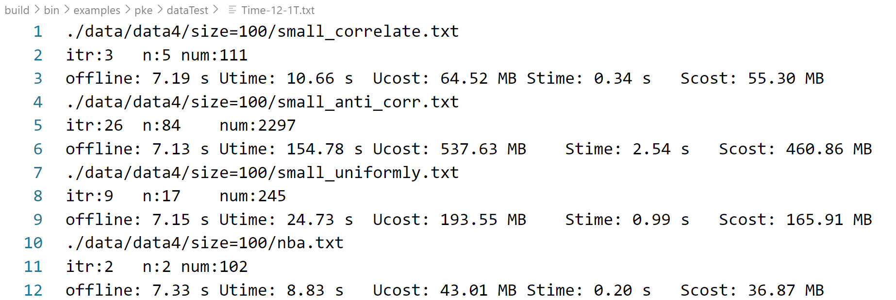

# DSky

The source code is located in ./openfhe-development/src/pke/examples/skyline.cpp

## Introduction:

run the code:

`cd ./build/bin/examples/pke/`

To test the files, we prepared the relevant executables, where "skylineTime-T" stands for basic filtering, "skylineTime-2T" for optimized filtering. "skylineGen.cpp" where its "data_pro.o" is used for dataset generation.
Moreover, we construct shell files where: 

1. name: "t" denotes the dataset (0 to 3, representing four datasets: corr, anti, inde, and nba),
2. dim: "d" denotes the dimension (3 to 7, representing 3 to 7 dimensions),
3. size: "n" denotes the size (0 to 4, representing (100, 500, 1000, 2000, 4000))

## Run test example:

For example, run the command.

`nohup ./Trun.sh >output.txt 2>&1 &`

, the whole console output is stored in "output.txt".

## Other test

You can also be executed individually with the following command:

`./skylineTime-2T n=1000 d=3 t=0`

the test result is generated in the following file:"./dataTest/Time-12-1T.txt"

The iteration number n1, skyline number n2, \sum function number n3, Query Time, Query Cost are printed. For example:



## ！Note

If you want to modify the "skyline.cpp" file and actually produce the new executable, follow **openfhe**'s process: https://openfhe-development.readthedocs.io/en/latest/sphinx_rsts/intro/installation/installation.html

In a nutshell:

```
cd build
cmake ..
make install
```